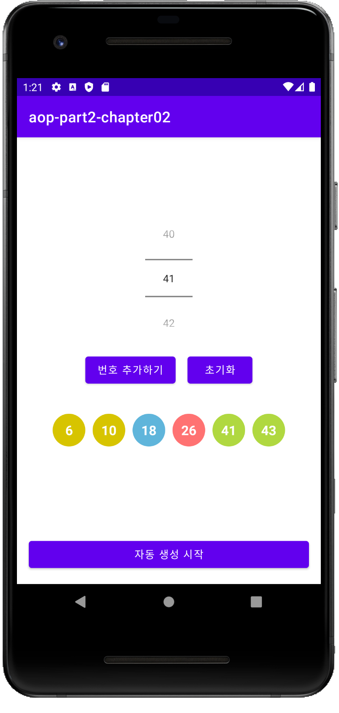

# aop-part2-chapter02 - 로또 번호 추첨기

# 목차

1. 인트로 (완성앱 & 구현 기능 소개)
2. Collection 개념소개
3. 로또번호 추첨 알고리즘 생각해보기
4. Constraintlayout 이용하여 기본 UI 그리기 (1)
5. Constraintlayout 이용하여 기본 UI 그리기 (2)
6. 기능 구현하기 (1)
7. 기능 구현하기 (2)
8. Resource 를 이용하여 꾸며보기
9. 아웃트로 (정리)

# 결과화면

# 이 챕터를 통해 배우는 것

- **Layout** 을 그리는 법
  - **ConstraintLayout** 사용하기
  - **NumberPicker** 의 속성들과 사용하는 법
  - **TextView** 의 속성들과 사용하는 법 (복습)
  - **Button** 사용하는 법 (복습)
- **Layout** 과 **Kotlin** 코드를 함께 사용하기
- **버그** 수정해보기
- 중복 코드 정리하기
- Shape Drawable 사용하기 
  - (https://developer.android.com/guide/topics/resources/drawable-resource#Shape)

### Kotlin 문법

apply

When

Random

Collection

​	- Set, List

람다함수

### 로또 번호 추첨기

0~5개까지 수동 선택 가능하도록 구현하기

수동선택한 번호를 제외한 나머지 번호는 랜덤으로 표시하기

